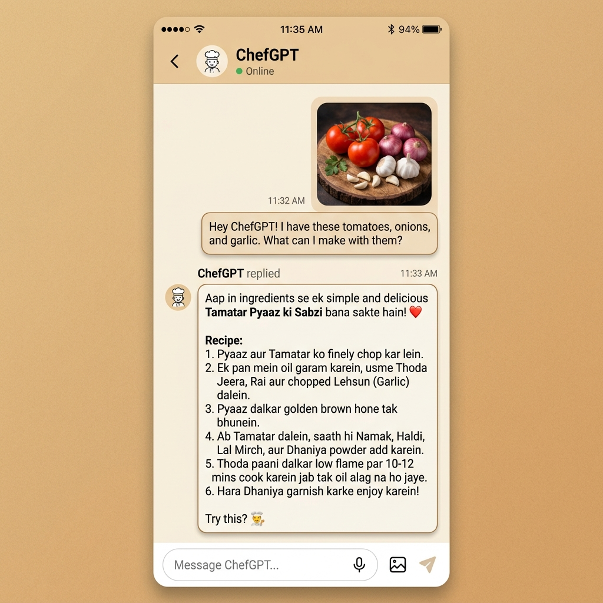

# 🍳 ChefGPT — Cook Smart, Eat Well

<p align="center">
  <strong>An AI-powered personal cooking assistant that identifies ingredients from photos and suggests Indian recipes tailored to your dietary preferences.</strong>
</p>

<p align="center">
  
  
  
  
</p>

---

## 📖 About

**ChefGPT** is a Flutter mobile application that acts as your personal AI-powered Indian home chef. Simply snap a photo of the ingredients in your kitchen, and ChefGPT will analyze the image using Google's **Gemini 2.5 Flash** model to identify the ingredients and recommend authentic Indian recipes you can cook right away.

The AI responds in **Hinglish** (a natural mix of Hindi and English), giving it a warm, homely feel — just like getting advice from a family member in the kitchen.

---

## 📸 Screenshots

<p align="center">
  
  
</p>

---

## ✨ Features

### 🤖 AI-Powered Ingredient Analysis
- Upload a photo from your gallery or take one with the camera
- Gemini AI identifies all visible ingredients in real time
- Recipes are suggested using only the identified ingredients and common Indian pantry staples

### 💬 Interactive Chat Interface
- Multi-turn conversational chat with the AI chef
- Ask follow-up questions, request variations, or explore new recipe ideas
- Animated "Thinking…" indicator while the AI processes your request

### 🎤 Voice Input (Speech-to-Text)
- Speak your queries instead of typing
- Integrated speech-to-text with a pulsing mic indicator
- Seamless switching between text and voice input

### 🥗 Dietary Preferences
- Configure dietary restrictions to personalize recipe suggestions
- Supported diets: **Vegan**, **Keto**, **Low Carbs**, **Gluten-Free**, **Fasting**, **Low Salt**
- Visual diet cards with custom illustrations

### 📒 Saved & Shared Recipes
- Save your favorite recipes for later
- Share recipes with friends and family

### 👤 User Profile
- Personalized user profile with account details
- Quick access to diet restrictions, shared recipes, and notifications

### 🎨 Beautiful UI / UX
- Warm **Roti Beige** and **Spice Red** color palette inspired by Indian cuisine
- Custom mascot character throughout the app
- 3D pressable cards with tactile shadow animations
- Staggered entrance animations on the home screen
- Neo-brutalist design elements with food-pattern overlays

---

## 🏗️ Project Structure

```
chefgpt/
├── lib/
│   ├── main.dart                          # App entry point & theme configuration
│   ├── screens/
│   │   ├── starting_screen.dart           # Welcome / splash screen
│   │   ├── login_screen.dart              # User login
│   │   ├── signup_screen.dart             # User registration
│   │   ├── forgot_password_screen.dart    # Password recovery
│   │   ├── home_screen.dart               # Main dashboard with animated cards
│   │   ├── analyse_screen.dart            # Image preview + description input
│   │   ├── chat_window_screen.dart        # AI chat interface
│   │   ├── diet_setting_screen.dart       # Dietary preference configuration
│   │   ├── saved_recipes_screen.dart      # Bookmarked recipes
│   │   ├── shared_recipes_screen.dart     # Shared recipe feed
│   │   └── profile_screen.dart            # User profile & settings
│   └── services/
│       └── gemini_service.dart            # Gemini AI service (text + image)
├── assets/
│   ├── images/                            # SVG illustrations, mascots & icons
│   └── screenshots/                       # Generated mobile app screenshot mockups
├── design/                                # Brand guidelines, screen designs, and agent config assets
├── pubspec.yaml                           # Dependencies & asset declarations
└── README.md
```

---

## 🛠️ Tech Stack

| Layer          | Technology                                                                 |
|----------------|---------------------------------------------------------------------------|
| **Framework**  | [Flutter](https://flutter.dev) (Material 3)                               |
| **Language**   | [Dart](https://dart.dev) `^3.11.0`                                        |
| **AI Model**   | [Google Gemini 2.5 Flash](https://ai.google.dev/) via `google_generative_ai` |
| **Image Input**| [`image_picker`](https://pub.dev/packages/image_picker)                   |
| **Voice Input**| [`speech_to_text`](https://pub.dev/packages/speech_to_text)               |
| **SVG Rendering** | [`flutter_svg`](https://pub.dev/packages/flutter_svg)                 |

---

## 🚀 Getting Started

### Prerequisites

- [Flutter SDK](https://docs.flutter.dev/get-started/install) (3.x or later)
- A [Google AI Studio](https://aistudio.google.com/) API key for Gemini

### Installation

1. **Clone the repository**
   ```bash
   git clone https://github.com/your-username/chefgpt.git
   cd chefgpt
   ```

2. **Install dependencies**
   ```bash
   flutter pub get
   ```

3. **Obtain a Google Gemini API Key**
   - Head over to [Google AI Studio](https://aistudio.google.com/).
   - Sign in with your Google account.
   - Click on the **Get API key** button in the top left or center dashboard.
   - Click **Create API key** and choose to either connect it to an existing Google Cloud project or create a new key in a new project.
   - Copy your generated API key (it starts with `AIzaSy...`).

4. **Configure and Run the App**
   There are two options to configure the Gemini API key in the application:

   #### Option A: Command Line Injection (Recommended & Secure)
   Run or build the app by passing the API key directly via `--dart-define`. This prevents the key from being hardcoded or committed to git:
   ```bash
   flutter run --dart-define=GEMINI_API_KEY=your_copied_api_key_here
   ```

   #### Option B: Code-level Default Value (Easy Dev Setup)
   Open [gemini_service.dart](file:///d:/Mobile%20app/chefgpt/lib/services/gemini_service.dart) and update line 8 with your API key:
   ```dart
   const String _kGeminiApiKey = String.fromEnvironment(
     'GEMINI_API_KEY',
     defaultValue: 'your_copied_api_key_here', // <-- Paste your key here
   );
   ```
   After updating the file, simply run the app using:
   ```bash
   flutter run
   ```

---

## 📱 App Flow

```
Starting Screen → Login / Sign Up → Home Screen
                                        │
                    ┌───────────────────┼───────────────────┐
                    │                   │                   │
             Analyze Kitchen      Saved Recipes         Profile
                    │                                      │
              Pick Image                          Diet Settings
                    │                             Shared Recipes
           Analyse Screen                           Log Out
          (preview + notes)
                    │
             Chat Window
        (AI conversation + 
         voice input + images)
```

---

## 🎨 Design System

| Token             | Hex         | Usage                            |
|-------------------|-------------|----------------------------------|
| **Spice Red**     | `#E63946`   | Primary accent, buttons, CTAs    |
| **Roti Beige**    | `#FFF8E1`   | Background, warm base tone       |
| **Charcoal Ink**  | `#1A1A1A`   | Text, borders, shadows           |
| **Pudina Green**  | `#4CAF76`   | Success states, banner gradient  |
| **Bubble Beige**  | `#F5E6A3`   | Input fields, secondary surfaces |

---

## 🔧 Key Implementation Details

### Gemini AI Service (`gemini_service.dart`)
- **Multi-turn chat sessions** — maintains conversation context across messages
- **Image + text multimodal input** — sends photos alongside text prompts
- **Automatic retry with exponential backoff** — handles 503, 429, timeout, and network errors gracefully
- **User-friendly error messages** — converts raw API errors into warm, readable notifications
- **Markdown stripping** — cleans AI responses for plain-text rendering in the chat UI
- **System instruction** — preconfigured to respond as an Indian home chef in Hinglish

### Animations
- Staggered fade + slide entrance on the home screen (greeting → CTA → menu cards)
- 3D pressable card effect with shadow animation on tap
- Animated "Thinking…" dots during AI processing
- Pulsing red dot for active voice recording

---

## 🤝 Contributing

Contributions are welcome! Feel free to open issues or submit pull requests.

1. Fork the repository
2. Create your feature branch (`git checkout -b feature/amazing-feature`)
3. Commit your changes (`git commit -m 'Add amazing feature'`)
4. Push to the branch (`git push origin feature/amazing-feature`)
5. Open a Pull Request

---

## 📄 License

This project is for educational and personal use. Please ensure you comply with Google's [Gemini API Terms of Service](https://ai.google.dev/terms) when using the AI features.

---

<p align="center">
  Made with ❤️ and 🍛 by <strong>Sarthak</strong>
</p>
